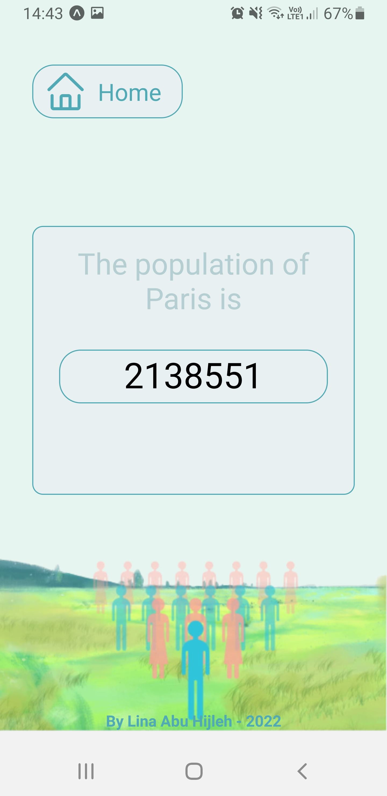

# CityPop

CityPop is a mobile application where the user can search for how many inhabitants a certain city has. The user can either search by city or by country.

## Usage Example

  

## Used technologies

- For running the app:
   - ExpoGo version 2.24.4
   - Expo CLI version 5.4.4
   - Expo version 45.0.0
- For testing: 
   - ESLint version 8.16.0
   - Jest version 27.5.1
   - Flow version 0.178.1
- For creating the app: 
   - React version 17.0.2
   - React Native version 0.68.2
   - Typescript version 4.3.5
   - npm version 8.10.0
   - NodeJs version 16.14.0
   - Visual Studio Code version 1.67.2
   - Used API : Geonames (http://www.geonames.org/export/geonames-search.html)

## How to run the program

- Download the project
- Download ExpoGo on your mobile device
- Make sure to have the latest versions of node and npm by running node -v and npm -v otherwise download them
- Go to the terminal on your computer then to your downloaded project and run npm install
- Run npm start
- Open ExpoGo and scan the QR code or go to the given link
- Enjoy !

## Project done by Lina Abu Hijleh
 
